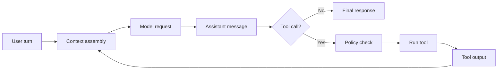

# Lab 00: Orientation

This lab sets up the reading environment and the habits used through the rest of Codex the Hard Way.

## Objective

By the end of this lab, you should have:

- A local checkout of the Codex source you intend to study.
- A journal file for recording observations.
- A repeatable way to search the source.
- A first-pass vocabulary for the harness.

## The Harness, In One Pass

For this guide, "the harness" means the software layer around the model that:

1. Receives a user turn.
2. Builds the instruction and context stack.
3. Sends requests to the model.
4. Receives assistant messages and tool calls.
5. Decides whether tool calls may run directly or require approval.
6. Executes tools, captures results, and feeds them back to the model.
7. Applies edits to the workspace.
8. Produces the final assistant response.

That loop is the main object of study.



## Setup

Choose a location for the Codex source checkout and export it as `CODEX_SRC`:

```sh
export CODEX_SRC="$HOME/src/codex"
```

This guide intentionally does not assume a specific checkout path. Every lab should work from `CODEX_SRC`.

Confirm the source is searchable:

```sh
rg "tool|sandbox|approval|conversation|turn" "$CODEX_SRC"
```

Create a reading journal:

```sh
mkdir -p notes
printf "# Codex Source Journal\n\n" > notes/source-journal.md
```

Do not treat the journal as polished documentation. It is a lab notebook: commit hashes, file paths, questions, wrong guesses, and corrected mental models are all useful.

## First Source Probes

Run these searches and record the most promising files:

```sh
rg "approval" "$CODEX_SRC"
rg "sandbox" "$CODEX_SRC"
rg "apply_patch" "$CODEX_SRC"
rg "tool_call|tool call|function_call" "$CODEX_SRC"
rg "conversation|session|turn" "$CODEX_SRC"
```

For each result cluster, write down:

- The file path.
- The symbol names around the match.
- Whether the code defines data, policy, execution, or presentation.
- One question you cannot answer yet.

## Checkpoint

Before moving to Lab 01, you should be able to answer:

- Where does a turn enter the harness?
- Where are tools described to the model?
- Where are shell commands or file edits evaluated against policy?
- Where does tool output re-enter the conversation?

It is fine if the answers are partial. The point is to make the unknowns explicit.

