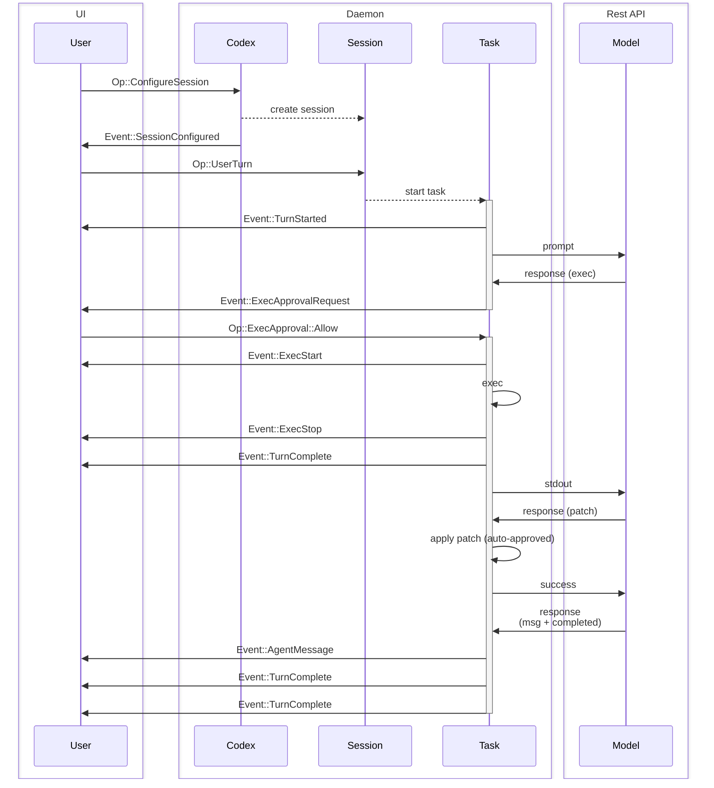

# Lab 01: Follow One Turn

This lab follows a single user request through the harness.

## Objective

Build a timeline that explains what happens between a user asking for a small code change and Codex returning a final answer.

The timeline should include:

- The user message.
- The active instruction stack.
- The compiled system prompt and other model-visible input.
- Any model requests.
- Any tool calls.
- Policy decisions for those tool calls.
- Hook or event boundaries before and after model or tool work.
- File edits or command outputs.
- The final response.

## Pick A Tiny Turn

Use a request small enough that the full loop can fit on one page:

```text
Create a file named hello.txt that contains hello codex.
```

This is intentionally boring. A boring task makes the harness behavior easier to see.

## Render The Actual Flow

Use this sequence as the concrete shape of the turn. It names the UI, daemon, session, task, model, approval, exec, patch, and completion boundaries that the rest of the lab asks you to prove from source.



Treat every arrow as a claim to verify. A completed Lab 01 should make it clear which arrows are user-visible events, which arrows are model I/O, which arrows are local daemon work, and which arrows mutate the workspace.

## Trace The Path

Start with source probes rather than assumptions:

```sh
rg "ConfigureSession|UserTurn|SessionConfigured|TurnStarted|TurnComplete" "$CODEX_SRC"
rg "user message|user_message|UserMessage|turn" "$CODEX_SRC"
rg "system prompt|instructions|developer|context" "$CODEX_SRC"
rg "tool_call|function_call|ToolCall" "$CODEX_SRC"
rg "approval|sandbox|policy" "$CODEX_SRC"
rg "hook|hooks|pre_|post_|Event::|Op::" "$CODEX_SRC"
rg "final answer|final_response|Final" "$CODEX_SRC"
```

For each promising symbol, ask:

- Is this data shape part of the conversation transcript?
- Is this code preparing input for the model?
- Is this code interpreting model output?
- Is this code enforcing local policy?
- Is this code presentation for the terminal or app?

## What To Prove

Before tracing source code, make sure you know which model API shape the harness is using. The edge labeled `task->>agent: prompt` may be a Responses API request, a Chat Completions request, or an internal abstraction over one of them. Lab 02, [OpenAI API Boundary](02-openai-api-boundary.md), is the early lecture for that boundary.

### 1. Actions Leading Into The Model

Trace the path from `Op::ConfigureSession` through `Op::UserTurn` to `task->>agent: prompt`.

Record:

- Where session configuration is received.
- Where a session is created and stored.
- Where a user turn becomes a task.
- Where `Event::TurnStarted` is emitted.
- Where the request to the model is built and sent.

### 2. System Prompt Compilation

Find the code that turns local state into model-visible input.

Record:

- System instructions.
- Developer or harness instructions.
- Repository instruction files such as `AGENTS.md`.
- User message.
- Workspace context.
- Tool schemas.
- Any policy or sandbox metadata visible to the model.

Use a table like this:

| Model input part | Source location | Runtime value or evidence |
| --- | --- | --- |
| System prompt | | |
| Developer instructions | | |
| `AGENTS.md` instructions | | |
| User turn | | |
| Tool schemas | | |
| Workspace context | | |

For a focused lecture and test matrix, use [Testing AGENTS.md And Approvals](../reference/testing-agents-and-approvals.md).

To dump the actual model-visible input for this lab:

```sh
mkdir -p notes
codex -C "$PWD" debug prompt-input "Create a file named hello.txt that contains hello codex." > notes/prompt-input.json
```

Treat that JSON file as sensitive. It may include system instructions, developer instructions, local paths, `AGENTS.md` contents, and the user turn.

### 3. Tool Calls

Trace both model-requested actions shown in the diagram:

- `response (exec)` becomes an executable tool request.
- `response (patch)` becomes a patch application.

For each one, identify:

- The model output shape.
- The parser or dispatcher that recognizes the tool call.
- The local code that executes it.
- The result sent back to the model.

### 4. Approvals

The diagram shows two different approval paths:

- `exec` asks the user with `Event::ExecApprovalRequest`, then resumes after `Op::ExecApproval::Allow`.
- `apply patch` is marked `auto-approved`.

Find the policy branch that explains that difference. Record the sandbox mode, approval mode, command or patch type, and the code path that decides whether to ask the user.

### 5. Hooks

Look for explicit hook APIs first. If this checkout does not expose a named hook system, document the event boundaries that behave like integration points.

Check at least these boundaries:

- Before the prompt is sent to the model.
- After a model response is received.
- Before a tool starts.
- After a tool stops.
- Before the final turn-complete event.

For each boundary, record whether it is a named hook, an event emission point, a callback, a stream item, or no extension point in this checkout.

## Timeline Template

Copy this table into your journal and fill it in while reading:

| Step | Sequence edge | Source location | Runtime evidence |
| --- | --- | --- | --- |
| 1 | `user->>codex: Op::ConfigureSession` | | |
| 2 | `codex-->>session: create session` | | |
| 3 | `codex->>user: Event::SessionConfigured` | | |
| 4 | `user->>session: Op::UserTurn` | | |
| 5 | `session-->>+task: start task` | | |
| 6 | `task->>user: Event::TurnStarted` | | |
| 7 | `task->>agent: prompt` | | |
| 8 | `agent->>task: response (exec)` | | |
| 9 | `task->>-user: Event::ExecApprovalRequest` | | |
| 10 | `user->>+task: Op::ExecApproval::Allow` | | |
| 11 | `task->>user: Event::ExecStart` | | |
| 12 | `task->>task: exec` | | |
| 13 | `task->>user: Event::ExecStop` | | |
| 14 | `task->>agent: stdout` | | |
| 15 | `agent->>task: response (patch)` | | |
| 16 | `task->>task: apply patch (auto-approved)` | | |
| 17 | `task->>agent: success` | | |
| 18 | `agent->>task: response (msg + completed)` | | |
| 19 | `task->>user: Event::AgentMessage` | | |
| 20 | `task->>user: Event::TurnComplete` | | |

Evidence can be a log line, debugger observation, test, source branch, or a small reproduction.

## What To Notice

The important question is not just "where did it happen?" It is "what boundary was crossed?"

Look for boundaries like:

- User text to structured turn.
- Local instructions to model-visible instructions.
- Model text to tool invocation.
- Proposed action to policy decision.
- Tool output to model-visible observation.
- Workspace mutation to user-facing summary.

Those boundaries are where surprises usually live.

## Checkpoint

You are done when you can explain the turn without using the phrase "Codex just does it." The explanation should name the major runtime events, show what went into the model, explain how tool calls and approvals were handled, identify hook or event boundaries, and point to source locations for each one.
