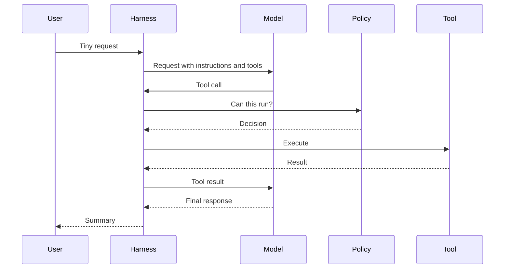

# Lab 01: Follow One Turn

This lab follows a single user request through the harness.

## Objective

Build a timeline that explains what happens between a user asking for a small code change and Codex returning a final answer.

The timeline should include:

- The user message.
- The active instruction stack.
- Any model requests.
- Any tool calls.
- Policy decisions for those tool calls.
- File edits or command outputs.
- The final response.

## Pick A Tiny Turn

Use a request small enough that the full loop can fit on one page:

```text
Create a file named hello.txt that contains hello codex.
```

This is intentionally boring. A boring task makes the harness behavior easier to see.

## Trace The Path

Start with source probes rather than assumptions:

```sh
rg "user message|user_message|UserMessage|turn" "$CODEX_SRC"
rg "tool_call|function_call|ToolCall" "$CODEX_SRC"
rg "approval|sandbox|policy" "$CODEX_SRC"
rg "final answer|final_response|Final" "$CODEX_SRC"
```

For each promising symbol, ask:

- Is this data shape part of the conversation transcript?
- Is this code preparing input for the model?
- Is this code interpreting model output?
- Is this code enforcing local policy?
- Is this code presentation for the terminal or app?

## Timeline Template

Copy this table into your journal and fill it in while reading:

| Step | Source location | Runtime event | Evidence |
| --- | --- | --- | --- |
| 1 | | User turn accepted | |
| 2 | | Instructions and context assembled | |
| 3 | | Model request created | |
| 4 | | Tool schema included | |
| 5 | | Tool call received | |
| 6 | | Policy decision made | |
| 7 | | Tool executed | |
| 8 | | Tool result appended | |
| 9 | | Final response emitted | |

Evidence can be a log line, debugger observation, test, source branch, or a small reproduction.

## What To Notice

The important question is not just "where did it happen?" It is "what boundary was crossed?"

Look for boundaries like:

- User text to structured turn.
- Local instructions to model-visible instructions.
- Model text to tool invocation.
- Proposed action to policy decision.
- Tool output to model-visible observation.
- Workspace mutation to user-facing summary.

Those boundaries are where surprises usually live.

## Minimal Diagram

After filling the timeline, draw the path with the actual symbol names from your checkout:



Replace the generic participant names with real modules or components once you know them.

## Checkpoint

You are done when you can explain the turn without using the phrase "Codex just does it." The explanation should name the major runtime events and point to source locations for each one.

