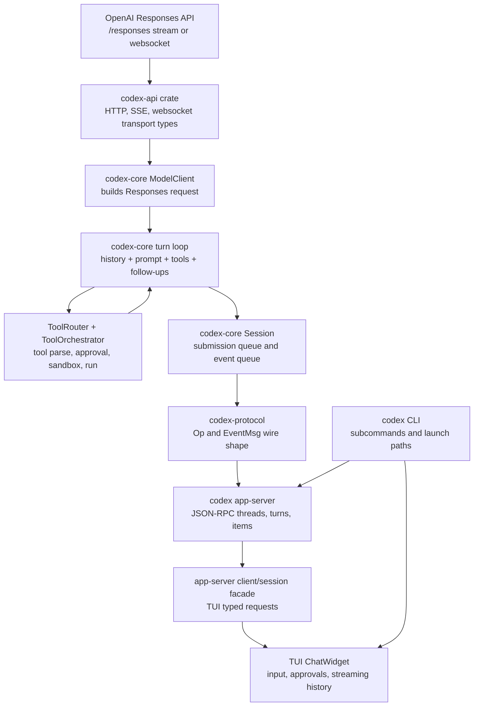
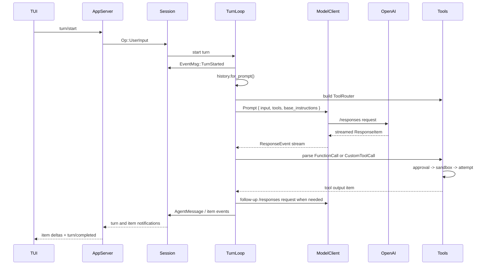

# Codex Vertical Stack

This note maps the current Codex stack from the OpenAI API boundary up through core session execution, app-server JSON-RPC, and the terminal UI.

The concrete source checkout used for this assessment was:

```text
/Users/fridiculous/projects/codex
```

Codex changes quickly, so treat the file paths as a source-reading map, not as permanent API documentation. Re-run the probes at the end when the checkout changes.

## One-Screen Model



The important boundary split is:

- Model API boundary: Codex serializes model-visible state into a Responses API request.
- Core runtime boundary: Codex turns streamed response items into messages, tool calls, approvals, local side effects, and follow-up model requests.
- Client boundary: app-server and TUI convert core events into thread, turn, item, approval, and streaming UI surfaces.

## Layer By Layer

| Layer | Responsibility | Source anchors |
| --- | --- | --- |
| CLI entrypoint | Parses `codex`, `codex exec`, `codex app-server`, `codex debug`, `codex resume`, and other launch paths. | `/Users/fridiculous/projects/codex/codex-rs/cli/src/main.rs` |
| TUI | Captures user input, handles slash commands and approvals, renders streaming turn items and history cells. | `/Users/fridiculous/projects/codex/codex-rs/tui/src/chatwidget.rs`, `/Users/fridiculous/projects/codex/codex-rs/tui/src/chatwidget/input_submission.rs` |
| TUI app-server facade | Owns typed JSON-RPC calls for the TUI: thread start/resume/fork, turn start/steer/interrupt, review, settings, skills, models, account state. | `/Users/fridiculous/projects/codex/codex-rs/tui/src/app_server_session.rs` |
| app-server | Exposes Codex as JSON-RPC over stdio, websocket, or unix socket. Its user-facing primitives are thread, turn, and item. | `/Users/fridiculous/projects/codex/codex-rs/app-server/README.md` |
| app-server protocol | Defines client requests and server notifications such as `thread/started`, `turn/started`, `item/started`, `item/completed`, `item/agentMessage/delta`, and `turn/completed`. | `/Users/fridiculous/projects/codex/codex-rs/app-server-protocol/src/protocol/common.rs` |
| core protocol | Defines the lower-level session protocol: `Submission`, `Op`, and `EventMsg`. | `/Users/fridiculous/projects/codex/codex-rs/protocol/src/protocol.rs` |
| session | Owns the submission queue/event queue session runtime. `Codex::spawn`, `submit`, and `next_event` are the core handles. | `/Users/fridiculous/projects/codex/codex-rs/core/src/session/mod.rs` |
| turn loop | Builds prompt input from history, runs hooks, calls the model, processes streamed response items, dispatches tool calls, and decides whether another model request is needed. | `/Users/fridiculous/projects/codex/codex-rs/core/src/session/turn.rs` |
| tools | Converts Responses output items into internal tool calls, exposes model-visible tool specs, dispatches handlers, gates execution through approval and sandbox policy. | `/Users/fridiculous/projects/codex/codex-rs/core/src/tools/router.rs`, `/Users/fridiculous/projects/codex/codex-rs/core/src/tools/orchestrator.rs` |
| model client | Builds and streams Responses API requests. This is the main OpenAI API boundary. | `/Users/fridiculous/projects/codex/codex-rs/core/src/client.rs` |

## The API Boundary

Current Codex is Responses-API shaped at the model edge.

The `ModelClient` comments say it is session-scoped and that a per-turn `ModelClientSession` streams one or more Responses API requests. The same file names `/responses` and `/responses/compact` as endpoints.

In `build_responses_request`, Codex maps core prompt state into the request:

| Codex concept | Responses request field |
| --- | --- |
| selected model | `model` |
| base instructions | `instructions` |
| conversation and current turn input | `input` |
| model-visible tools | `tools` |
| tool policy | `tool_choice: "auto"` and `parallel_tool_calls` |
| reasoning controls | `reasoning` |
| output schema / verbosity | `text` |
| thread affinity | `prompt_cache_key` |

The normal HTTP stream path is instrumented as `model_client.stream_responses_api` with `transport = "responses_http"` and `api.path = "responses"`. The websocket path is instrumented as `model_client.stream_responses_websocket`, also with `api.path = "responses"`. Websocket prewarm can send `generate=false`, then reuse the connection and `previous_response_id`.

That means the simplified lab arrow:

```text
task -> model: prompt
```

really means:

```text
history + current user input + base instructions + model-visible tool schemas
    -> ResponsesApiRequest
    -> /responses over HTTP SSE or Responses websocket
    -> streamed ResponseItem events
```

## One Turn, Expanded



## What To Inspect For "Exactly What Happened"

Use these surfaces in order:

1. Model-visible input: `codex debug prompt-input ...`
2. API request and response stream: `CODEX_ROLLOUT_TRACE_ROOT=...` plus `codex debug trace-reduce`
3. Core event flow: `EventMsg` in `codex-protocol`
4. App/client event flow: app-server JSON-RPC notifications in `codex-app-server-protocol`
5. UI rendering: `ChatWidget` event handlers and history cells

Do not conflate these layers. A thing can be:

- model-visible but not user-visible,
- user-visible but not model-visible,
- persisted in rollout history but not sent in the next prompt,
- emitted as a legacy core event and later translated into a richer app-server item notification,
- executed locally after an approval/sandbox decision without being part of the model API at all.

## Source Probes

```sh
CODEX_SRC=/Users/fridiculous/projects/codex

rg "RESPONSES_ENDPOINT|build_responses_request|stream_responses_api|stream_responses_websocket|previous_response_id" "$CODEX_SRC/codex-rs/core/src/client.rs"
rg "pub enum Op|pub enum EventMsg|UserInput|ExecApproval|PatchApproval|TurnStarted|TurnComplete|AgentMessage" "$CODEX_SRC/codex-rs/protocol/src/protocol.rs"
rg "build_prompt|run_sampling_request|handle_output_item_done|ResponseItem::FunctionCall|ResponseItem::CustomToolCall" "$CODEX_SRC/codex-rs/core/src/session/turn.rs"
rg "ToolRouter|build_tool_call|model_visible_specs|dispatch_tool_call" "$CODEX_SRC/codex-rs/core/src/tools"
rg "approval|sandbox|ToolOrchestrator|ExecApprovalRequirement|SandboxAttempt" "$CODEX_SRC/codex-rs/core/src/tools"
rg "turn/start|turn/started|item/started|item/completed|turn/completed" "$CODEX_SRC/codex-rs/app-server"
rg "AppServerSession|TurnStartParams|ServerNotification|ChatWidget" "$CODEX_SRC/codex-rs/tui/src"
```

